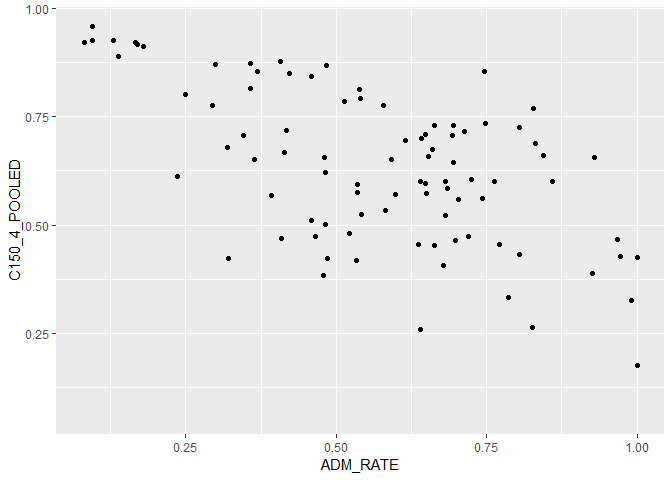
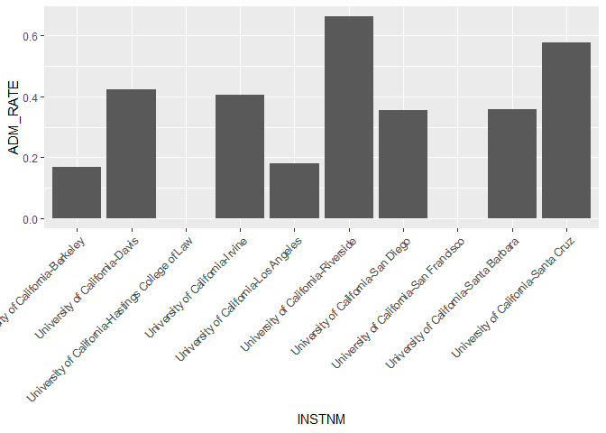

## Instructions
This exam is designed to show me what you have learned and where there are problems. You may use your notes and anything from the `class_files` folder, but please no internet searches. You have 35 minutes to complete as many of these exercises as possible on your own, and 10 minutes to work with a partner.  

At the end of the exam, upload the complete .Rmd file to your GitHub repository.  


1. Load the tidyverse.

```r
library(tidyverse)
```

```
## -- Attaching packages --------------------------------------------------------------------- tidyverse 1.2.1 --
```

```
## v ggplot2 3.1.0     v purrr   0.3.0
## v tibble  2.0.1     v dplyr   0.7.8
## v tidyr   0.8.2     v stringr 1.4.0
## v readr   1.3.1     v forcats 0.3.0
```

```
## -- Conflicts ------------------------------------------------------------------------ tidyverse_conflicts() --
## x dplyr::filter() masks stats::filter()
## x dplyr::lag()    masks stats::lag()
```

```r
library(skimr)
```


2. For these questions, we will use data about California colleges. Load the `ca_college_data.csv` as a new object called `colleges`.

```r
colleges <- readr::read_csv("C:/Users/Isha/Desktop/class_files-master/data/ca_college_data.csv")
```

```
## Parsed with column specification:
## cols(
##   INSTNM = col_character(),
##   CITY = col_character(),
##   STABBR = col_character(),
##   ZIP = col_character(),
##   ADM_RATE = col_double(),
##   SAT_AVG = col_double(),
##   PCIP26 = col_double(),
##   COSTT4_A = col_double(),
##   C150_4_POOLED = col_double(),
##   PFTFTUG1_EF = col_double()
## )
```


3. Use your preferred function to have a look at the data and get an idea of its structure.

```r
summary(colleges)
```

```
##     INSTNM              CITY              STABBR         
##  Length:341         Length:341         Length:341        
##  Class :character   Class :character   Class :character  
##  Mode  :character   Mode  :character   Mode  :character  
##                                                          
##                                                          
##                                                          
##                                                          
##      ZIP               ADM_RATE         SAT_AVG         PCIP26       
##  Length:341         Min.   :0.0807   Min.   : 870   Min.   :0.00000  
##  Class :character   1st Qu.:0.4581   1st Qu.: 985   1st Qu.:0.00000  
##  Mode  :character   Median :0.6370   Median :1078   Median :0.00000  
##                     Mean   :0.5901   Mean   :1112   Mean   :0.01981  
##                     3rd Qu.:0.7461   3rd Qu.:1237   3rd Qu.:0.02458  
##                     Max.   :1.0000   Max.   :1555   Max.   :0.21650  
##                     NA's   :240      NA's   :276    NA's   :35       
##     COSTT4_A     C150_4_POOLED     PFTFTUG1_EF    
##  Min.   : 7956   Min.   :0.0625   Min.   :0.0064  
##  1st Qu.:12578   1st Qu.:0.4265   1st Qu.:0.3212  
##  Median :16591   Median :0.5845   Median :0.5016  
##  Mean   :26685   Mean   :0.5705   Mean   :0.5577  
##  3rd Qu.:39289   3rd Qu.:0.7162   3rd Qu.:0.8117  
##  Max.   :69355   Max.   :0.9569   Max.   :1.0000  
##  NA's   :124     NA's   :221      NA's   :53
```

```r
glimpse(colleges)
```

```
## Observations: 341
## Variables: 10
## $ INSTNM        <chr> "Grossmont College", "College of the Sequoias", ...
## $ CITY          <chr> "El Cajon", "Visalia", "San Mateo", "Ventura", "...
## $ STABBR        <chr> "CA", "CA", "CA", "CA", "CA", "CA", "CA", "CA", ...
## $ ZIP           <chr> "92020-1799", "93277-2214", "94402-3784", "93003...
## $ ADM_RATE      <dbl> NA, NA, NA, NA, NA, NA, NA, NA, NA, NA, NA, NA, ...
## $ SAT_AVG       <dbl> NA, NA, NA, NA, NA, NA, NA, NA, NA, NA, NA, NA, ...
## $ PCIP26        <dbl> 0.0016, 0.0066, 0.0038, 0.0035, 0.0085, 0.0151, ...
## $ COSTT4_A      <dbl> 7956, 8109, 8278, 8407, 8516, 8577, 8580, 9181, ...
## $ C150_4_POOLED <dbl> NA, NA, NA, NA, NA, NA, 0.2334, NA, NA, NA, NA, ...
## $ PFTFTUG1_EF   <dbl> 0.3546, 0.5413, 0.3567, 0.3824, 0.2753, 0.4286, ...
```


4. What are the column names?

```r
colnames(colleges)
```

```
##  [1] "INSTNM"        "CITY"          "STABBR"        "ZIP"          
##  [5] "ADM_RATE"      "SAT_AVG"       "PCIP26"        "COSTT4_A"     
##  [9] "C150_4_POOLED" "PFTFTUG1_EF"
```


5. Are there any NA's in the data? If so, how many are present and in which variables?


```r
colleges %>%
  summarize(number_nas= sum(is.na(colleges)))
```

```
## # A tibble: 1 x 1
##   number_nas
##        <int>
## 1        949
```

6. Which cities in California have the highest number of colleges?


```r
t_summary <- colleges %>% 
  group_by(CITY) %>% 
  summarize(n_total = n())

t_summary
```

```
## # A tibble: 161 x 2
##    CITY        n_total
##    <chr>         <int>
##  1 Alameda           3
##  2 Anaheim           4
##  3 Angwin            1
##  4 Aptos             1
##  5 Arcata            1
##  6 Atherton          1
##  7 Azusa             1
##  8 Bakersfield       3
##  9 Barstow           1
## 10 Belmont           1
## # ... with 151 more rows
```


7. The column `COSTT4_A` is the annual cost of each institution. Which city has the highest cost?


```r
Cost <- colleges %>%
  select(COSTT4_A,CITY) %>%
arrange(desc(COSTT4_A))
Cost
```

```
## # A tibble: 341 x 2
##    COSTT4_A CITY         
##       <dbl> <chr>        
##  1    69355 Claremont    
##  2    67225 Los Angeles  
##  3    67064 Los Angeles  
##  4    67046 Los Angeles  
##  5    66325 Claremont    
##  6    66152 Malibu       
##  7    66060 Claremont    
##  8    65880 Claremont    
##  9    65453 San Francisco
## 10    64870 Claremont    
## # ... with 331 more rows
```


8. The column `ADM_RATE` is the admissions rate by college and `C150_4_POOLED` is the four-year completion rate. Use a scatterplot to show the relationship between these two variables. What does this mean?


```r
ggplot(data=colleges, mapping= aes(x=ADM_RATE, y= C150_4_POOLED))+
  geom_point()
```

```
## Warning: Removed 251 rows containing missing values (geom_point).
```

<!-- -->


9. The column titled `INSTNM` is the institution name. We are only interested in the University of California colleges. Run the code below and look at the output. Are all of the columns tidy? Why or why not?

```r
univ_calif <- 
colleges %>%
filter_all (any_vars (str_detect(., pattern = "University of California")))
univ_calif
```

```
## # A tibble: 10 x 10
##    INSTNM CITY  STABBR ZIP   ADM_RATE SAT_AVG PCIP26 COSTT4_A C150_4_POOLED
##    <chr>  <chr> <chr>  <chr>    <dbl>   <dbl>  <dbl>    <dbl>         <dbl>
##  1 Unive~ La J~ CA     92093    0.357    1324  0.216    31043         0.872
##  2 Unive~ Irvi~ CA     92697    0.406    1206  0.107    31198         0.876
##  3 Unive~ Rive~ CA     92521    0.663    1078  0.149    31494         0.73 
##  4 Unive~ Los ~ CA     9009~    0.180    1334  0.155    33078         0.911
##  5 Unive~ Davis CA     9561~    0.423    1218  0.198    33904         0.850
##  6 Unive~ Sant~ CA     9506~    0.578    1201  0.193    34608         0.776
##  7 Unive~ Berk~ CA     94720    0.169    1422  0.105    34924         0.916
##  8 Unive~ Sant~ CA     93106    0.358    1281  0.108    34998         0.816
##  9 Unive~ San ~ CA     9410~   NA          NA NA           NA        NA    
## 10 Unive~ San ~ CA     9414~   NA          NA NA           NA        NA    
## # ... with 1 more variable: PFTFTUG1_EF <dbl>
```

## yes each variable has its column and each obsevation has its own row

10. Use `separate()` to separate institution name into two new columns "UNIV" and "CAMPUS".


```r
colleges <- 
  colleges %>% 
  separate(INSTNM, c("UNIV", "CAMPUS"), sep="-")
```

```
## Warning: Expected 2 pieces. Additional pieces discarded in 9 rows [140,
## 145, 165, 173, 177, 292, 298, 299, 300].
```

```
## Warning: Expected 2 pieces. Missing pieces filled with `NA` in 264 rows [1,
## 2, 3, 4, 5, 6, 7, 8, 9, 10, 11, 12, 13, 14, 15, 16, 17, 18, 19, 20, ...].
```

```r
colleges
```

```
## # A tibble: 341 x 11
##    UNIV  CAMPUS CITY  STABBR ZIP   ADM_RATE SAT_AVG PCIP26 COSTT4_A
##    <chr> <chr>  <chr> <chr>  <chr>    <dbl>   <dbl>  <dbl>    <dbl>
##  1 Gros~ <NA>   El C~ CA     9202~       NA      NA 0.0016     7956
##  2 Coll~ <NA>   Visa~ CA     9327~       NA      NA 0.0066     8109
##  3 Coll~ <NA>   San ~ CA     9440~       NA      NA 0.0038     8278
##  4 Vent~ <NA>   Vent~ CA     9300~       NA      NA 0.0035     8407
##  5 Oxna~ <NA>   Oxna~ CA     9303~       NA      NA 0.0085     8516
##  6 Moor~ <NA>   Moor~ CA     9302~       NA      NA 0.0151     8577
##  7 Skyl~ <NA>   San ~ CA     9406~       NA      NA 0          8580
##  8 Glen~ <NA>   Glen~ CA     9120~       NA      NA 0.002      9181
##  9 Citr~ <NA>   Glen~ CA     9174~       NA      NA 0.0021     9281
## 10 Fres~ <NA>   Fres~ CA     93741       NA      NA 0.0324     9370
## # ... with 331 more rows, and 2 more variables: C150_4_POOLED <dbl>,
## #   PFTFTUG1_EF <dbl>
```


11. As a final step, remove `Hastings College of Law` and `UC San Francisco` and store the final data frame as a new object `univ_calif_final`.

```r
univ_calif_final <- 
  colleges %>% 
  filter(CAMPUS !="Hastings College of Law",
         CAMPUS !="San Francisco")
univ_calif_final
```

```
## # A tibble: 73 x 11
##    UNIV  CAMPUS CITY  STABBR ZIP   ADM_RATE SAT_AVG PCIP26 COSTT4_A
##    <chr> <chr>  <chr> <chr>  <chr>    <dbl>   <dbl>  <dbl>    <dbl>
##  1 Cali~ Domin~ Cars~ CA     9074~    0.479      NA 0.03      13027
##  2 Cali~ Los A~ Los ~ CA     9003~    0.637     870 0.042     13385
##  3 West~ Coali~ Coal~ CA     93210   NA          NA 0         13846
##  4 El C~ Compt~ Comp~ CA     9022~   NA          NA 0         15261
##  5 Cali~ San B~ San ~ CA     9240~    0.581     877 0.027     15988
##  6 Cali~ Fresno Fres~ CA     93740    0.535     907 0.0248    16078
##  7 Cali~ Baker~ Bake~ CA     9331~    0.678      NA 0.0671    16481
##  8 Cali~ Stani~ Turl~ CA     9538~    0.743      NA 0.0498    16588
##  9 Cali~ North~ Nort~ CA     91330    0.482     918 0.0341    16591
## 10 Cali~ Fulle~ Full~ CA     9283~    0.482    1017 0.0323    17049
## # ... with 63 more rows, and 2 more variables: C150_4_POOLED <dbl>,
## #   PFTFTUG1_EF <dbl>
```


12. The column `ADM_RATE` is the admissions rate by campus. Which UC has the lowest and highest admissions rates? Please use a barplot.

```r
univ_calif %>%
  ggplot(aes(x=INSTNM, y=ADM_RATE))+
  geom_bar(stat = "identity")+
  theme(axis.text.x = element_text(angle = 45, hjust=1))
```

```
## Warning: Removed 2 rows containing missing values (position_stack).
```

<!-- -->


## Knit Your Output and Post to [GitHub](https://github.com/FRS417-DataScienceBiologists)
