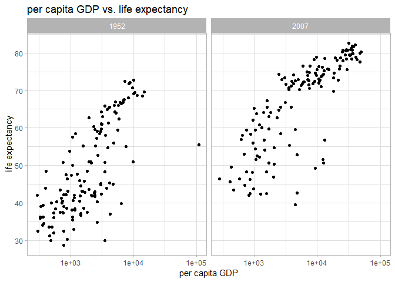

## Instructions
Answer the following questions and complete the exercises in RMarkdown. Please embed all of your code, keep track of your versions using git, and push your final work to our [GitHub repository](https://github.com/FRS417-DataScienceBiologists). I will randomly select a few examples of student work at the start of each session to use as examples so be sure that your code is working to the best of your ability.


```r
#install.packages("RColorBrewer")
```


## Load the libraries

```r
library(tidyverse)
library(skimr)
library("RColorBrewer")
```

## Resources
The idea for this assignment came from [Rebecca Barter's](http://www.rebeccabarter.com/blog/2017-11-17-ggplot2_tutorial/) ggplot tutorial so if you get lost go have a look. Please do not copy and paste her code!  

## Gapminder
For this assignment, we are going to use the dataset [gapminder](https://cran.r-project.org/web/packages/gapminder/index.html). Gapminder includes information about economics, population, and life expectancy from countries all over the world. You will need to install it before use.

```r
#install.packages("gapminder")
```


```r
library("gapminder")
```

Please load the data into a new object called gapminder.

```r
gapminder <- 
  gapminder::gapminder
```

1. Explore the data using the various function you have learned. Is it tidy, are there any NA's, what are its dimensions, what are the column names, etc.


```r
glimpse(gapminder)
```

```
## Observations: 1,704
## Variables: 6
## $ country   <fct> Afghanistan, Afghanistan, Afghanistan, Afghanistan, ...
## $ continent <fct> Asia, Asia, Asia, Asia, Asia, Asia, Asia, Asia, Asia...
## $ year      <int> 1952, 1957, 1962, 1967, 1972, 1977, 1982, 1987, 1992...
## $ lifeExp   <dbl> 28.801, 30.332, 31.997, 34.020, 36.088, 38.438, 39.8...
## $ pop       <int> 8425333, 9240934, 10267083, 11537966, 13079460, 1488...
## $ gdpPercap <dbl> 779.4453, 820.8530, 853.1007, 836.1971, 739.9811, 78...
```

```r
summary(gapminder)
```

```
##         country        continent        year         lifeExp     
##  Afghanistan:  12   Africa  :624   Min.   :1952   Min.   :23.60  
##  Albania    :  12   Americas:300   1st Qu.:1966   1st Qu.:48.20  
##  Algeria    :  12   Asia    :396   Median :1980   Median :60.71  
##  Angola     :  12   Europe  :360   Mean   :1980   Mean   :59.47  
##  Argentina  :  12   Oceania : 24   3rd Qu.:1993   3rd Qu.:70.85  
##  Australia  :  12                  Max.   :2007   Max.   :82.60  
##  (Other)    :1632                                                
##       pop              gdpPercap       
##  Min.   :6.001e+04   Min.   :   241.2  
##  1st Qu.:2.794e+06   1st Qu.:  1202.1  
##  Median :7.024e+06   Median :  3531.8  
##  Mean   :2.960e+07   Mean   :  7215.3  
##  3rd Qu.:1.959e+07   3rd Qu.:  9325.5  
##  Max.   :1.319e+09   Max.   :113523.1  
## 
```


2. We are interested in the relationship between per capita GDP and life expectancy; i.e. does having more money help you live longer on average. Make a quick plot below to visualize this relationship.

```r
gapminder %>%
  ggplot(aes(x=gdpPercap, y=lifeExp))+
  geom_point()+
  geom_point(shape = 21, colour = "black", fill = "red", size = 1, alpha=0.75)+
  labs(title="Relationship between per capita GDP and Life Expectancy", 
       x="per Capita GDP", 
       y="Life Expectancy")+
  theme(plot.title = element_text(size = rel(1.5), hjust = 0.5))
```

<!-- -->


3. There is extreme disparity in per capita GDP. Rescale the x axis to make this easier to interpret. How would you characterize the relationship?

```r
gapminder %>%
  ggplot(aes(x=gdpPercap, y=lifeExp))+
  geom_point()+
  scale_x_log10()+
  geom_point(shape = 21, colour = "black", fill = "red", size = 1, alpha=0.75)+
  labs(title="Relationship between per capita GDP and Life Expectancy", 
       x="per Capita GDP", 
       y="Life Expectancy")+
  theme(plot.title = element_text(size = rel(1.5), hjust = 0.5))
```

<!-- -->


4. This should look pretty dense to you with significant overplotting. Try using a faceting approach to break this relationship down by year.

```r
gapminder %>% 
  ggplot(aes(x=gdpPercap, y=lifeExp))+
  geom_point()+
  geom_point(shape = 21, colour = "black", fill = "red", size = 0.5, alpha=0.75)+
  scale_x_log10()+
  labs(title="Yearly Relationship between per capita GDP and Life Expectancy", 
       x = "per Capita GDP (log 10)",
       y = "Life expectancy (years)")+
      theme(plot.title = element_text(face="bold", hjust = 0.5))+
  facet_wrap(~year)
```

<!-- -->


5. Simplify the comparison by comparing only 1952 and 2007. Can you come to any conclusions?

```r
gapminder %>% 
  filter(year=="1952"|year=="2007") %>%  
  ggplot(aes(x=gdpPercap,y=lifeExp))+
  geom_point(shape = 21, colour = "black", fill = "red", size = 0.5, alpha=0.75)+
  geom_jitter()+
  scale_x_log10()+
  labs(title = "per capita GDP vs. life expectancy",
       x= "per capita GDP",
       y= "life expectancy")+
  facet_grid(~year)
```

<!-- -->

6. Let's stick with the 1952 and 2007 comparison but make some aesthetic adjustments. First try to color by continent and adjust the size of the points by population. Add `+ scale_size(range = c(0.1, 10), guide = "none")` as a layer to clean things up a bit.


```r
gapminder %>%
  filter(year==1952 | year==2007) %>% 
  ggplot(aes(x=gdpPercap, y=lifeExp, color=continent, size=pop))+
  geom_point()+
  geom_point(alpha=0.75)+
  scale_x_log10()+
  labs(title="Relationship between per capita GDP and Life Expectancy in 1952 & 2007", 
       x = "per Capita GDP (log 10)",
       y = "Life expectancy (years)")+
  theme(plot.title = element_text(face="bold", hjust = 0.2))+
  facet_grid(~year)+
  scale_size(range = c(0.1, 10), guide = "none")
```

<!-- -->


7. Although we did not introduce them in lab, ggplot has a number of built-in themes that make things easier. I like the light theme for these data, but you can see lots of options. Apply one of these to your plot above.

```r
gapminder %>% 
  filter(year=="1952"|year=="2007") %>%  
  ggplot(aes(x=gdpPercap,y=lifeExp))+
  geom_point(shape = 21, colour = "black", fill = "red", size = 0.5, alpha=0.75)+
  geom_jitter()+
  scale_x_log10()+
  labs(title = "per capita GDP vs. life expectancy",
       x= "per capita GDP",
       y= "life expectancy")+
  facet_grid(~year)+
theme_light()
```

<!-- -->

8. What is the population for all countries on the Asian continent in 2007? Show this as a barplot.

```r
gapminder %>%
  filter(continent=="Asia", year==2007) %>% 
  ggplot(aes(x=reorder(country, -pop), y=pop))+
  geom_col()+
  labs(title = "Population in 2007 of Countries in Asia",
       x = "Country",
       y = "Population size")+
  theme(plot.title = element_text(face="bold", hjust = 0.5),
        axis.text.x = element_text(angle = 60, hjust = 1),
        axis.text.y = element_text(angle = 90, hjust = 1))
```

<!-- -->

9. You should see that China's population is the largest with India a close second. Let's focus on China only. Make a plot that shows how population has changed over the years.


```r
gapminder %>% 
  filter(country=="China") %>% 
  ggplot(aes(x=year,y=pop))+
  geom_bar(stat = "identity")+
  labs(title = "Population Growth of China",
       x = "Year",
       y = "Population")+
  theme(plot.title = element_text(size = rel(1.25)))+
  scale_fill_brewer(palette = "Dark2")
```

<!-- -->

10. Let's compare China and India. Make a barplot that shows population growth by year using `position=dodge`. Apply a custom color theme using RColorBrewer.

```r
?RColorBrewer
```

```
## starting httpd help server ... done
```


```r
gapminder %>% 
  filter(country=="China"|country=="India") %>% 
  ggplot(aes(x=year,y=pop, fill=country))+
  geom_bar(stat = "identity",position="dodge")+
  labs(title = "Population Growth of China",
       x = "Year",
       y = "Population")+
   scale_fill_brewer(palette = "Set3")
```

<!-- -->

## Push your final code to [GitHub](https://github.com/FRS417-DataScienceBiologists)
Make sure that you push your code into the appropriate folder. Also, be sure that you have check the `keep md` file in the knit preferences.
