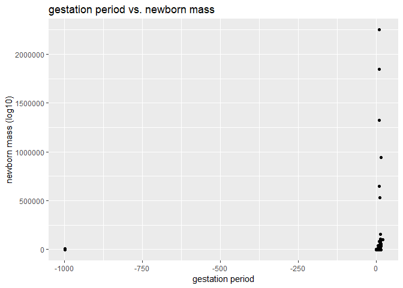
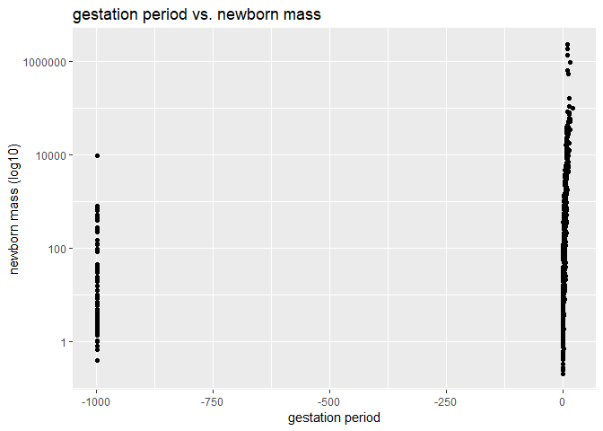

## Instructions
Answer the following questions and complete the exercises in RMarkdown. Please embed all of your code, keep track of your versions using git, and push your final work to our [GitHub repository](https://github.com/FRS417-DataScienceBiologists). I will randomly select a few examples of student work at the start of each session to use as examples so be sure that your code is working to the best of your ability.

## Load the tidyverse

```r
library(tidyverse)
library(skimr)
```

## Mammals Life History
Let's revisit the mammal life history data to practice our `ggplot` skills. Some of the tidy steps will be a repeat from the homework, but it is good practice. The [data](http://esapubs.org/archive/ecol/E084/093/) are from: *S. K. Morgan Ernest. 2003. Life history characteristics of placental non-volant mammals. Ecology 84:3402.*

1. Load the data.


```r
life_history <- readr::read_csv("data/mammal_lifehistories_v2.csv")
```

```
## Parsed with column specification:
## cols(
##   order = col_character(),
##   family = col_character(),
##   Genus = col_character(),
##   species = col_character(),
##   mass = col_double(),
##   gestation = col_double(),
##   newborn = col_double(),
##   weaning = col_double(),
##   `wean mass` = col_double(),
##   AFR = col_double(),
##   `max. life` = col_double(),
##   `litter size` = col_double(),
##   `litters/year` = col_double()
## )
```


2. Use your preferred function to have a look. Do you notice any problems?

```r
life_history
```

```
## # A tibble: 1,440 x 13
##    order family Genus species   mass gestation newborn weaning `wean mass`
##    <chr> <chr>  <chr> <chr>    <dbl>     <dbl>   <dbl>   <dbl>       <dbl>
##  1 Arti~ Antil~ Anti~ americ~ 4.54e4      8.13   3246.    3           8900
##  2 Arti~ Bovid~ Addax nasoma~ 1.82e5      9.39   5480     6.5         -999
##  3 Arti~ Bovid~ Aepy~ melamp~ 4.15e4      6.35   5093     5.63       15900
##  4 Arti~ Bovid~ Alce~ busela~ 1.50e5      7.9   10167.    6.5         -999
##  5 Arti~ Bovid~ Ammo~ clarkei 2.85e4      6.8    -999  -999           -999
##  6 Arti~ Bovid~ Ammo~ lervia  5.55e4      5.08   3810     4           -999
##  7 Arti~ Bovid~ Anti~ marsup~ 3.00e4      5.72   3910     4.04        -999
##  8 Arti~ Bovid~ Anti~ cervic~ 3.75e4      5.5    3846     2.13        -999
##  9 Arti~ Bovid~ Bison bison   4.98e5      8.93  20000    10.7       157500
## 10 Arti~ Bovid~ Bison bonasus 5.00e5      9.14  23000.    6.6         -999
## # ... with 1,430 more rows, and 4 more variables: AFR <dbl>, `max.
## #   life` <dbl>, `litter size` <dbl>, `litters/year` <dbl>
```


3. There are NA's. How are you going to deal with them?

```r
life_history %>% 
  summarize(number_nas= sum(is.na(life_history)))
```

```
## # A tibble: 1 x 1
##   number_nas
##        <int>
## 1          0
```

```r
life_history  %>%
  na_if(-999)
```

```
## # A tibble: 1,440 x 13
##    order family Genus species   mass gestation newborn weaning `wean mass`
##    <chr> <chr>  <chr> <chr>    <dbl>     <dbl>   <dbl>   <dbl>       <dbl>
##  1 Arti~ Antil~ Anti~ americ~ 4.54e4      8.13   3246.    3           8900
##  2 Arti~ Bovid~ Addax nasoma~ 1.82e5      9.39   5480     6.5           NA
##  3 Arti~ Bovid~ Aepy~ melamp~ 4.15e4      6.35   5093     5.63       15900
##  4 Arti~ Bovid~ Alce~ busela~ 1.50e5      7.9   10167.    6.5           NA
##  5 Arti~ Bovid~ Ammo~ clarkei 2.85e4      6.8      NA    NA             NA
##  6 Arti~ Bovid~ Ammo~ lervia  5.55e4      5.08   3810     4             NA
##  7 Arti~ Bovid~ Anti~ marsup~ 3.00e4      5.72   3910     4.04          NA
##  8 Arti~ Bovid~ Anti~ cervic~ 3.75e4      5.5    3846     2.13          NA
##  9 Arti~ Bovid~ Bison bison   4.98e5      8.93  20000    10.7       157500
## 10 Arti~ Bovid~ Bison bonasus 5.00e5      9.14  23000.    6.6           NA
## # ... with 1,430 more rows, and 4 more variables: AFR <dbl>, `max.
## #   life` <dbl>, `litter size` <dbl>, `litters/year` <dbl>
```

```r
life_history
```

```
## # A tibble: 1,440 x 13
##    order family Genus species   mass gestation newborn weaning `wean mass`
##    <chr> <chr>  <chr> <chr>    <dbl>     <dbl>   <dbl>   <dbl>       <dbl>
##  1 Arti~ Antil~ Anti~ americ~ 4.54e4      8.13   3246.    3           8900
##  2 Arti~ Bovid~ Addax nasoma~ 1.82e5      9.39   5480     6.5         -999
##  3 Arti~ Bovid~ Aepy~ melamp~ 4.15e4      6.35   5093     5.63       15900
##  4 Arti~ Bovid~ Alce~ busela~ 1.50e5      7.9   10167.    6.5         -999
##  5 Arti~ Bovid~ Ammo~ clarkei 2.85e4      6.8    -999  -999           -999
##  6 Arti~ Bovid~ Ammo~ lervia  5.55e4      5.08   3810     4           -999
##  7 Arti~ Bovid~ Anti~ marsup~ 3.00e4      5.72   3910     4.04        -999
##  8 Arti~ Bovid~ Anti~ cervic~ 3.75e4      5.5    3846     2.13        -999
##  9 Arti~ Bovid~ Bison bison   4.98e5      8.93  20000    10.7       157500
## 10 Arti~ Bovid~ Bison bonasus 5.00e5      9.14  23000.    6.6         -999
## # ... with 1,430 more rows, and 4 more variables: AFR <dbl>, `max.
## #   life` <dbl>, `litter size` <dbl>, `litters/year` <dbl>
```


4. Where are the NA's? This is important to keep in mind as you build plots.


```r
life_history %>%
  purrr::map_df(~ sum(is.na(.)))%>% 
  tidyr::gather(variables, num_nas) %>% 
  arrange(desc(num_nas))
```

```
## # A tibble: 13 x 2
##    variables    num_nas
##    <chr>          <int>
##  1 order              0
##  2 family             0
##  3 Genus              0
##  4 species            0
##  5 mass               0
##  6 gestation          0
##  7 newborn            0
##  8 weaning            0
##  9 wean mass          0
## 10 AFR                0
## 11 max. life          0
## 12 litter size        0
## 13 litters/year       0
```


5. Some of the variable names will be problematic. Let's rename them here as a final tidy step.


```r
life_history %>% 
rename (
          genus        = Genus,
          wean_mass    = `wean mass`,
          max_life     = `max. life`,
          litter_size  = `litter size`,
          litters_yr   = `litters/year`
          )
```

```
## # A tibble: 1,440 x 13
##    order family genus species   mass gestation newborn weaning wean_mass
##    <chr> <chr>  <chr> <chr>    <dbl>     <dbl>   <dbl>   <dbl>     <dbl>
##  1 Arti~ Antil~ Anti~ americ~ 4.54e4      8.13   3246.    3         8900
##  2 Arti~ Bovid~ Addax nasoma~ 1.82e5      9.39   5480     6.5       -999
##  3 Arti~ Bovid~ Aepy~ melamp~ 4.15e4      6.35   5093     5.63     15900
##  4 Arti~ Bovid~ Alce~ busela~ 1.50e5      7.9   10167.    6.5       -999
##  5 Arti~ Bovid~ Ammo~ clarkei 2.85e4      6.8    -999  -999         -999
##  6 Arti~ Bovid~ Ammo~ lervia  5.55e4      5.08   3810     4         -999
##  7 Arti~ Bovid~ Anti~ marsup~ 3.00e4      5.72   3910     4.04      -999
##  8 Arti~ Bovid~ Anti~ cervic~ 3.75e4      5.5    3846     2.13      -999
##  9 Arti~ Bovid~ Bison bison   4.98e5      8.93  20000    10.7     157500
## 10 Arti~ Bovid~ Bison bonasus 5.00e5      9.14  23000.    6.6       -999
## # ... with 1,430 more rows, and 4 more variables: AFR <dbl>,
## #   max_life <dbl>, litter_size <dbl>, litters_yr <dbl>
```

```r
life_history
```

```
## # A tibble: 1,440 x 13
##    order family Genus species   mass gestation newborn weaning `wean mass`
##    <chr> <chr>  <chr> <chr>    <dbl>     <dbl>   <dbl>   <dbl>       <dbl>
##  1 Arti~ Antil~ Anti~ americ~ 4.54e4      8.13   3246.    3           8900
##  2 Arti~ Bovid~ Addax nasoma~ 1.82e5      9.39   5480     6.5         -999
##  3 Arti~ Bovid~ Aepy~ melamp~ 4.15e4      6.35   5093     5.63       15900
##  4 Arti~ Bovid~ Alce~ busela~ 1.50e5      7.9   10167.    6.5         -999
##  5 Arti~ Bovid~ Ammo~ clarkei 2.85e4      6.8    -999  -999           -999
##  6 Arti~ Bovid~ Ammo~ lervia  5.55e4      5.08   3810     4           -999
##  7 Arti~ Bovid~ Anti~ marsup~ 3.00e4      5.72   3910     4.04        -999
##  8 Arti~ Bovid~ Anti~ cervic~ 3.75e4      5.5    3846     2.13        -999
##  9 Arti~ Bovid~ Bison bison   4.98e5      8.93  20000    10.7       157500
## 10 Arti~ Bovid~ Bison bonasus 5.00e5      9.14  23000.    6.6         -999
## # ... with 1,430 more rows, and 4 more variables: AFR <dbl>, `max.
## #   life` <dbl>, `litter size` <dbl>, `litters/year` <dbl>
```


##`ggplot()`
For the questions below, try to use the aesthetics you have learned to make visually appealing and informative plots. Make sure to include labels for the axes and titles.

```r
options(scipen=999) #cancels the use of scientific notation for the session
```

6. What is the relationship between newborn body mass and gestation? Make a scatterplot that shows this relationship. 
names(lifehistories)

```r
names(life_history)
```

```
##  [1] "order"        "family"       "Genus"        "species"     
##  [5] "mass"         "gestation"    "newborn"      "weaning"     
##  [9] "wean mass"    "AFR"          "max. life"    "litter size" 
## [13] "litters/year"
```

```r
ggplot(data=life_history, mapping=aes(x=gestation, y=newborn))+
  geom_jitter()+
  labs(title = "gestation period vs. newborn mass",
       x = "gestation period",
       y = "newborn mass (log10)")
```

<!-- -->


7. You should notice that because of the outliers in newborn mass, we need to make some changes. We didn't talk about this in lab, but you can use `scale_x_log10()` as a layer to correct for this issue. This will log transform the y-axis values.


```r
ggplot(data=life_history, mapping=aes(x=gestation, y=newborn))+
  geom_jitter()+
  scale_y_log10()+
  labs(title = "gestation period vs. newborn mass",
       x = "gestation period",
       y = "newborn mass (log10)")
```

```
## Warning in self$trans$transform(x): NaNs produced
```

```
## Warning: Transformation introduced infinite values in continuous y-axis
```

```
## Warning: Removed 595 rows containing missing values (geom_point).
```

<!-- -->


8. Now that you have the basic plot, color the points by taxonomic order.


9. Lastly, make the size of the points proportional to body mass.


10. Make a plot that shows the range of lifespan by order.


```


## Push your final code to [GitHub](https://github.com/FRS417-DataScienceBiologists)
Make sure that you push your code into the appropriate folder. Also, be sure that you have check the `keep md` file in the knit preferences.
